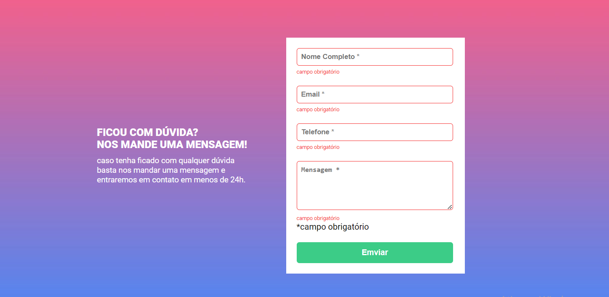
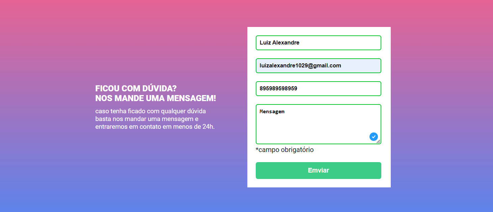

# Desefio proposto pelo curso Dev em Dobro
Esse projeto foi feito com propósito de treinar meus conhecimentos com HTML5, CSS3, JAVASCRIPT 

# FORMULÁRIO
## Aqui estar nossa primeira tela, a primeira impressão do nosso site.
[]

## Nessa imagem percebemos quando o Formulário é enviado com campos vazios. 
[]

## Campos validados ✅
[]